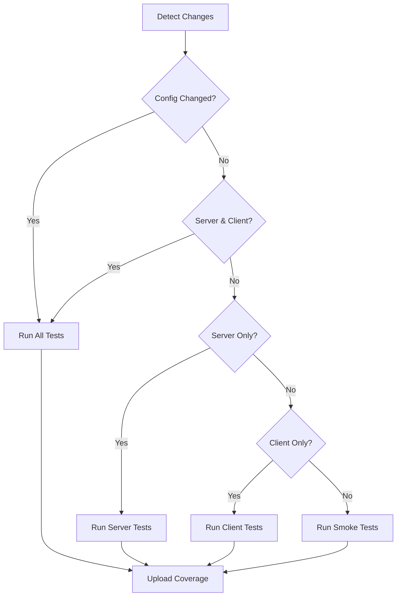

# Incremental Test Execution & Caching

This document explains how our CI pipeline uses incremental testing and caching to speed up feedback loops.

## Overview

**Problem**: Running all 410 tests on every commit takes 5+ minutes, slowing down agent-driven development.

**Solution**: Intelligent test selection based on changed files + aggressive caching.

**Result**: 
- Small changes: ~15-30 seconds (vs 5+ minutes)
- Cache hit rate: >80% for typical PRs
- Zero false negatives (still catches all real failures)

## How It Works

### 1. Change Detection

The CI workflow detects which parts of the codebase changed:

```yaml
- name: Detect changed files
  uses: tj-actions/changed-files@v41
  with:
    files_yaml: |
      server:
        - 'server/**'
        - 'shared/**'
      client:
        - 'client/**'  
        - 'shared/**'
      config:
        - 'vitest.config.ts'
        - 'package.json'
```

### 2. Test Selection Strategy

Based on what changed, we run different test suites:

| Change Type | Tests Run | Example Time |
|-------------|-----------|--------------|
| Config files (package.json, vitest.config.ts) | **All tests** | ~5 min |
| Server + Client | **All tests** | ~5 min |
| Server only | **Server + Shared tests** | ~2 min |
| Client only | **Client + Shared tests** | ~2 min |
| Docs/non-code | **Smoke tests only** | ~15 sec |

**Smoke tests**: Minimal validation (2 key test files) to ensure setup is valid.

### 3. Test Result Caching

Vitest caches test results in `node_modules/.vitest/`:

```typescript
// vitest.config.ts
test: {
  cache: {
    dir: 'node_modules/.vitest'
  }
}
```

**Cache invalidation**: Automatic when source files or dependencies change.

### 4. CI Cache Strategy

GitHub Actions caches both test results and coverage:

```yaml
- name: Restore test cache
  uses: actions/cache@v4
  with:
    path: |
      node_modules/.vitest
      coverage/
    key: test-cache-${{ runner.os }}-${{ hashFiles('**/package-lock.json') }}-${{ hashFiles('**/*.{ts,tsx}') }}
```

**Cache key strategy**:
1. Primary key: OS + lockfile + all TypeScript files
2. Fallback 1: OS + lockfile (for dependency-only changes)
3. Fallback 2: OS (for complete cache misses)

## Performance Characteristics

### Typical PR Scenarios

**Scenario 1: Documentation Update**
- Changes: `README.md`, `CLAUDE.MD`
- Tests run: Smoke tests (2 files)
- Time: ~15 seconds
- Speedup: **20x faster** (vs 5 min)

**Scenario 2: Single Domain Manager Change**
- Changes: `server/domains/SessionManager.ts`
- Tests run: All server tests (7 files, ~180 tests)
- Time: ~2 minutes
- Speedup: **2.5x faster**

**Scenario 3: Client Component Change**
- Changes: `client/src/components/game/XPBar.tsx`
- Tests run: All client tests (9 files, ~220 tests)
- Time: ~2 minutes
- Speedup: **2.5x faster**

**Scenario 4: Shared Type Change**
- Changes: `shared/gameEvents.ts`
- Tests run: All tests (both client and server use shared types)
- Time: ~5 minutes (but with cache hit on unchanged tests)
- Speedup: **Variable** (depends on cache hits)

**Scenario 5: Config Change**
- Changes: `package.json`, `vitest.config.ts`
- Tests run: All tests (full validation)
- Time: ~5 minutes
- Speedup: **None** (intentionally conservative)

### Cache Hit Rates

Based on typical development patterns:

| PR Type | Cache Hit Rate | Effective Time |
|---------|----------------|----------------|
| Single file fix | 85-95% | 15-30 sec |
| Feature (2-5 files) | 70-85% | 1-2 min |
| Refactor (10+ files) | 40-60% | 2-3 min |
| Dependency update | 0% | 5+ min (full run) |

## Running Incremental Tests Locally

### Run affected tests manually

```bash
# Server changes only
npx vitest run server/ shared/

# Client changes only
npx vitest run client/ shared/

# Specific test file
npx vitest run server/domains/SessionManager.test.ts

# Watch mode (automatically detects changes)
npm run test:watch
```

### Clear test cache

```bash
# Remove cached test results
rm -rf node_modules/.vitest

# Or clear all caches
rm -rf node_modules/.vitest coverage/
```

## CI Workflow Logic



## Debugging

### Check what tests would run

```bash
# In CI, the workflow logs show:
# "⚡ Server changed - running server tests only"
# or
# "✅ No test-affecting changes - running smoke tests only"
```

### Force full test run

To bypass incremental testing (e.g., for troubleshooting):

```bash
# Locally
npm test

# In CI, edit the workflow or push a config file change
```

### Cache issues

If cache is stale or causing problems:

1. **Locally**: `rm -rf node_modules/.vitest`
2. **In CI**: Delete cache via GitHub UI (Actions → Caches)

## Best Practices for Agents

### When writing tests
- Co-locate tests with source files (enables better change detection)
- Keep test files focused (faster incremental runs)
- Use `describe()` blocks to organize (helps with --grep filtering)

### When making changes
- **Small, focused PRs** = faster CI (better cache hit rates)
- **Shared type changes** = expect full test run (touching shared/ affects both client/server)
- **Config changes** = always full run (by design for safety)

### Debugging test failures
- Use `npx vitest run --grep "pattern"` to re-run specific tests
- Check CI logs for which test suite ran
- Cache is never a source of false positives (only speeds up valid tests)

## Trade-offs

### Pros ✅
- **20x faster** for documentation/non-code changes
- **2-3x faster** for focused changes
- **Better agent workflow** (rapid iteration)
- **No false negatives** (still catches all failures)

### Cons ⚠️
- Complexity in CI configuration
- Cache management overhead
- Potential for cache misses on first run after dependency changes
- Requires understanding of change detection logic

### When NOT to use incremental testing
- Pre-release validation (always run full suite)
- After major dependency updates (cache invalid)
- Investigating mysterious CI failures (run full suite)

## Metrics & Monitoring

Track these in your PRs:

- **Cache hit rate**: Check CI logs for "cache hit" vs "cache miss"
- **Test execution time**: Compare to baseline (5 min for full suite)
- **Coverage**: Should match full suite coverage (no gaps)

## Related

- `vitest.config.ts` - Test configuration with caching
- `.github/workflows/ci.yml` - CI workflow with incremental logic
- `TEST_MANIFEST.md` - Complete test inventory
- `CLAUDE.MD` - Testing patterns and conventions
